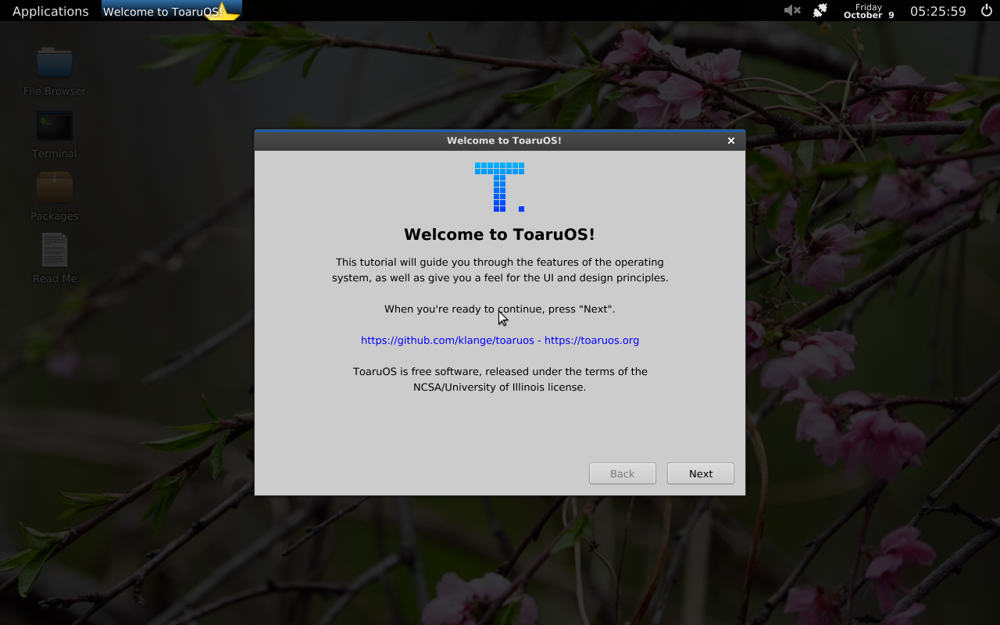
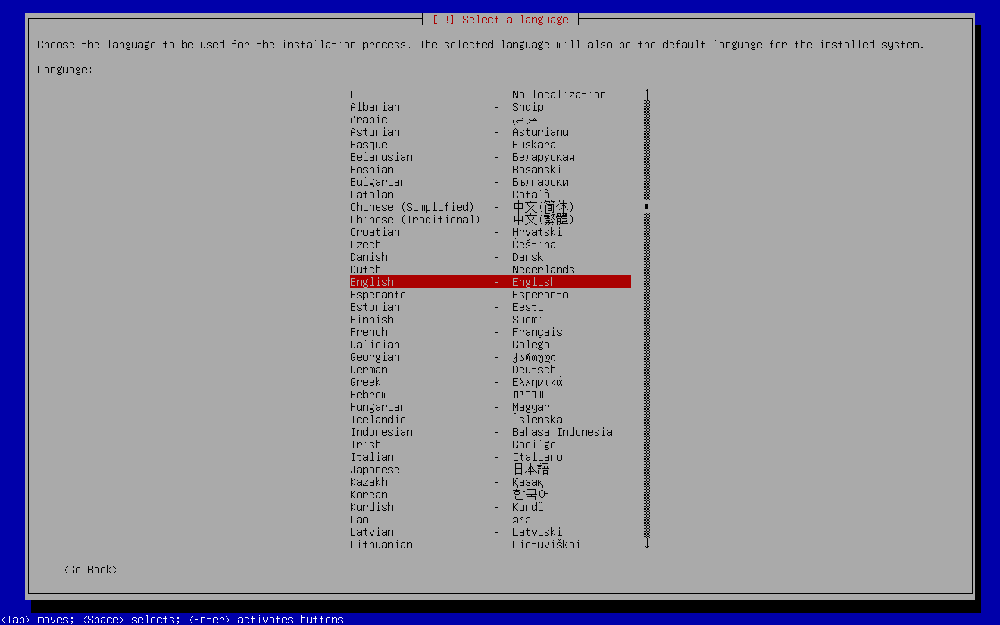
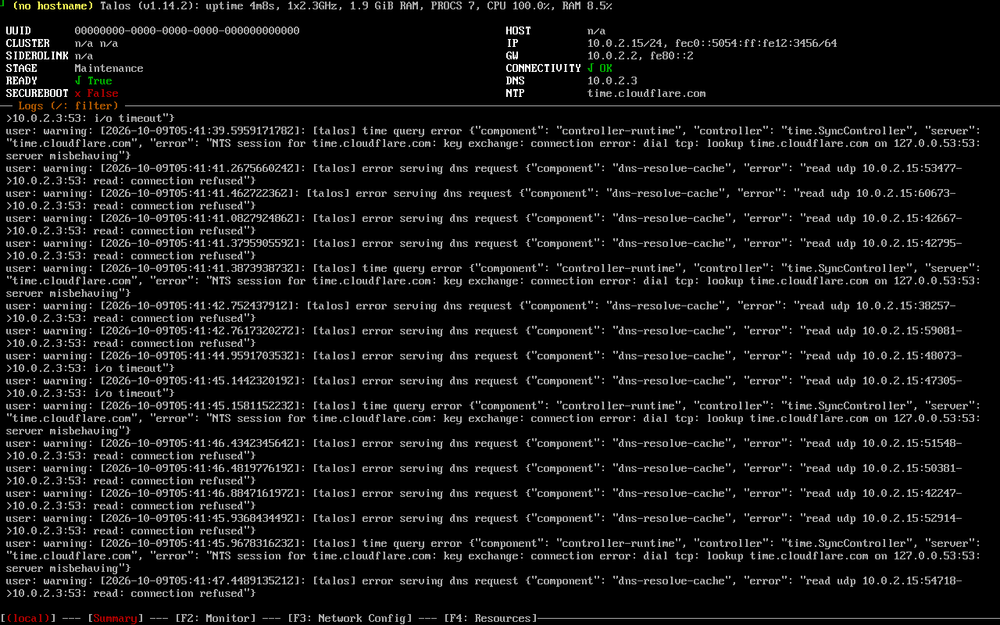

# 実ISOの追加検証（2026-10-09）

8本のISOを追加しました。前回のAlpine standardを含めると、現在方式での結果は **9本中PASS 4本、UNSUPPORTED 5本** です。Linux以外ではHelenOSとToaruOSの実ISOをQEMU＋OVMFで検証しました。

製品のGRUBモジュール・展開方式は変更していません。追加したのは検証用ツール、期待値の指定、記録です。ISO付属EFI・kernel・initramfs・設定・kernel引数を変更するOS固有hackは追加していません。

## 現在方式での結果

PASSはkernelの表示だけでなく、ログイン後のuser spaceまたはLive OSのReady画面まで確認したものです。UNSUPPORTEDは展開前に明示的に拒否したものです。

| ISO | 系統 | 結果 | 到達した段階・理由 |
|---|---|---|---|
| Alpine standard 3.22.3 x86_64 | Linux | PASS（前回の結果） | SATA/USBともrootログイン、元のcmdline・FAT boot media・120ファイル一致 |
| Alpine virt 3.22.3 x86_64 | Linux | PASS | stock EFI → GRUB → Linux `6.12.67-0-virt` → rootログイン。元のvirt kernel引数とFAT mountを確認 |
| Alpine extended 3.22.3 x86_64 | Linux | PASS | stock EFI → GRUB → Linux `6.12.67-0-lts` → rootログイン。元のkernel引数とFAT mountを確認 |
| Talos Linux 1.14.2 amd64 | Linux | PASS（必要CPU機能・NICあり） | stock systemd-boot → stock UKI → Linux/Talos user space → dashboardの `STAGE Maintenance` / `READY True` |
| Debian 12 bookworm netboot mini | Linux | UNSUPPORTED | `NO_EFI_LOADER`。loaderはISOの通常treeではなく `/boot/grub/efi.img` 内 |
| Debian 13 trixie netboot mini | Linux | UNSUPPORTED | `NO_EFI_LOADER`。loaderはISOの通常treeではなく `/boot/grub/efi.img` 内 |
| Ubuntu 18.04 bionic netboot mini（2021-09-14 build） | Linux | UNSUPPORTED | `NO_EFI_LOADER`。loaderはISOの通常treeではなく `/boot/grub/efi.img` 内 |
| HelenOS 0.11.2 amd64 | 非Linux | UNSUPPORTED | `NO_EFI_LOADER`。当該amd64 ISOはBIOS El Torito entryのみで、x86_64 UEFI loaderがない |
| ToaruOS 2.3.2 x86_64 | 非Linux | UNSUPPORTED | `NO_EFI_LOADER`。UEFI entryはあるがloaderは `/fat.img` 内で、ISO通常treeにはない |

**Debian miniとDebian Live、Ubuntu miniとUbuntu Desktop/Serverの結果は区別してください。** 上記mini ISOの結果を、それぞれのLive/通常インストーラーISO全体へ一般化しません。以前取得できなかったArch、Debian Live、Ubuntu 24.04、Fedora、openSUSE、FreeBSDの互換性は未判定のままです。

virtは120ファイル・8ディレクトリ、extendedは508ファイル・8ディレクトリを元ISOと比較し、全ファイルのバイト一致を確認しました。extended ISOは1,169,817,600 bytesなので、DATA/SCRATCHを各2048MiBにして試験しました。

## 元ISOの比較起動

次の2本では、**比較用VMだけ** に元ISOを通常の光学メディアとして接続しました。現在方式のPASS数には含めません。製品に仮想CD-ROMや仮想Block Deviceのboot handlerを追加したものではありません。

| 元ISO | 比較起動の結果 | 確認した画面 |
|---|---|---|
| Debian 13 trixie mini | PASS | UEFI → stock GRUB → kernel/initramfs → Debian installerの言語選択画面 |
| ToaruOS 2.3.2 | PASS | UEFI → ISO付属loader → 独自kernel/user space → デスクトップとWelcomeアプリ |





この比較から、**UEFI対応ISOでも、ISO通常treeに `/EFI/BOOT/BOOTX64.EFI` がないものは現方式では起動できない** ことを確認しました。単に全ファイルをFATへコピーしても、内蔵EFI FAT imageの中身までは展開されません。今回はこの制限を記録し、方式の追加変更は行っていません。

## Talosの調査と到達点

QEMU既定CPU `qemu64` では、stock UKIのEFI stubで `#UD` 例外が発生しました。dumpのRIPとImageBaseからoffset `0x1f5e6` を求め、元UKIの該当命令が `popcnt %rdi,%rax` であることを確認しました。QEMUのCPUを汎用モデル `max` に変更すると、この例外は解消しました。OSのkernel引数やイメージは変更していません。

最終構成はQ35/TCG、CPU max、RAM 2048MiB、通常のvirtio NIC＋QEMU user networkingです。NICなしの試験ではmachined起動まで進みましたが、Ready画面は未確認でした。最終構成では新規ディスクを作り直した自動再実行も終了コード0で成功し、版名・Maintenance・Ready Trueを画面で照合しています。



起動後にFAT上の `BOOTX64.EFI` とUKIを元ISO由来のファイルとSHA-256で比較し、変更されていないことを確認しました。TalosのDNS/NTPにはこの環境の外部接続に由来する警告が残ります。インストール、APIへの外部接続、Kubernetes cluster構築は未検証です。

## 再現方法と証拠

URL・ファイルサイズ・SHA-256・RAM/CPU/容量・検証条件は [iso-matrix.json](../tests/iso-matrix.json) に固定しています。Linux 6本は公式checksumと照合しました。HelenOS/ToaruOSはmaintainerのGitHub releaseから取得し、ローカルSHA-256を記録しました。後者2本について独立した公開checksumや署名の検証を済ませたとは扱いません。

```sh
make test-isos                        # 8本を順番に取得・検証（時間とディスク容量を要します）
source scripts/env.sh
python3 scripts/test-isos.py --download-only
python3 scripts/test-isos.py --only toaruos-2.3.2
python3 scripts/test-isos.py --only talos-1.14.2-amd64
```

生成物は `.build/matrix-ID/`、入力ISOは `.build/iso-matrix/`。指定したimageは作り直すため、使用中のVMを止めてから再実行してください。Debian/UbuntuのURLに含まれる `current` が更新された場合は固定checksumとの不一致で停止します。その場合は当該checksumのISOが必要です。

`test-isos.py` のAlpine判定はguest内のuname/cmdline/FAT mountと全ファイル比較、Talos判定は元の版名・Maintenance・Ready Trueの画面照合です。OSにkernel引数を渡し直す機構ではありません。UNSUPPORTEDを期待したcaseはテスト自体が終了コード0でも、OS互換性の結果はUNSUPPORTEDです。

比較起動は明示的な別オプションで実行できます。

```sh
python3 scripts/iso-observe.py .build/iso-matrix/toaruos-2.3.2.iso \
  --optical-control --out .build/toaruos-control --timeout 180 \
  --send-key ret --key-after 12 --expect-screen '(?s)Applications.*Welcome to ToaruOS.*Next'
python3 scripts/iso-observe.py .build/iso-matrix/debian-trixie-mini.iso \
  --optical-control --out .build/debian-control --timeout 360 \
  --send-key ret --key-after 15 --expect-screen 'Select a language'
```

実際の実行ログは `.build/iso-matrix/preflight-tests.log`、`virt-boot-final.log`、`extended-boot.log`、`talos-replay-final.log`。個別serial・画面・OCRは各 `.build/matrix-ID/` に保存しています。Talosの最終自動結果は `.build/matrix-talos-1.14.2-amd64/result.json`、初期CPU例外とNICなしの観測は同ディレクトリの `observed/` / `observed-max/` に残しています。

FreeBSD、NetBSD、OpenBSD、Haikuは公式配布先へのHTTPS CONNECTが403で、今回もISOを取得できませんでした。ReactOSのSourceForge downloadもHTTP 403で取得不能でした。これらを起動失敗やUNSUPPORTEDとは判定しません。
